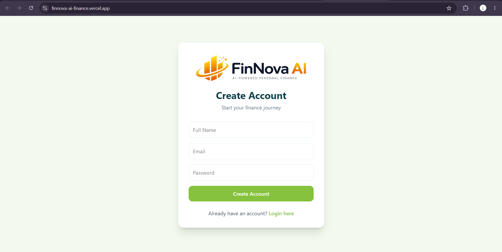
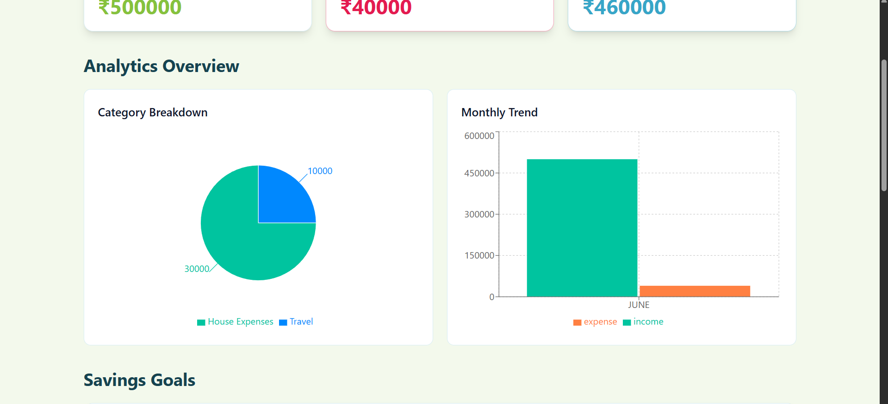
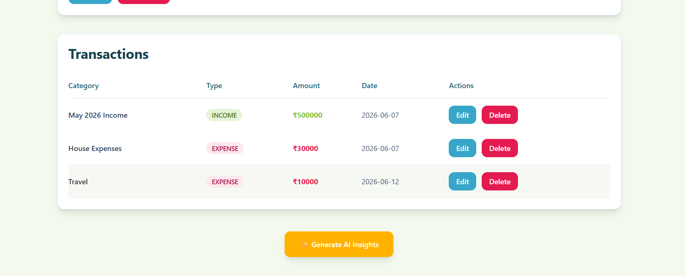
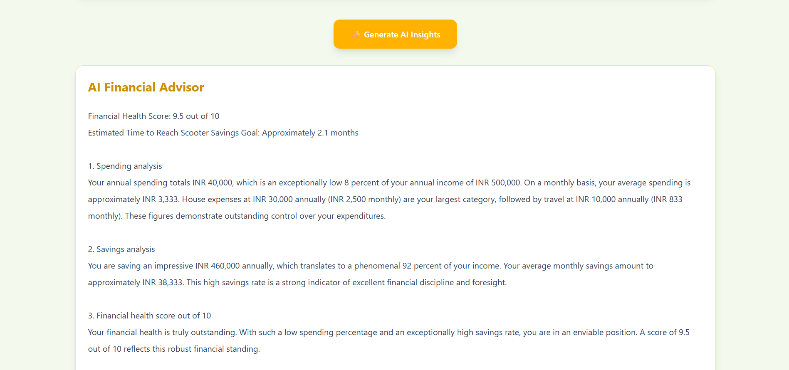
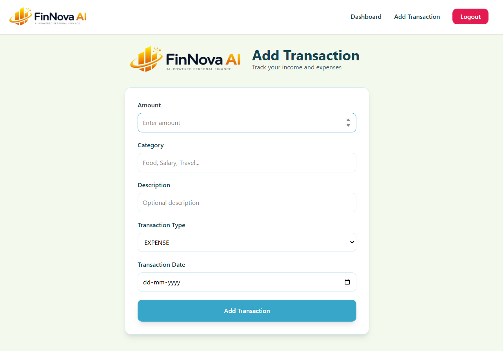

# FinNova AI Frontend

AI-Powered Personal Finance Tracker Frontend built using React, Vite, Tailwind CSS, Recharts, and Axios.

Live Demo:
https://finnova-ai-finance.vercel.app/

---

## Overview

FinNova AI is a modern personal finance management platform that helps users:

- Track income and expenses
- Visualize financial data through charts
- Manage savings goals
- Generate AI-powered financial insights
- Monitor financial health in real time

This repository contains the frontend application responsible for the user interface and user experience.

---

## Features

### Authentication

- User Registration
- User Login
- JWT Token Storage
- Protected Routes
- Automatic Authentication Handling

### Dashboard

- Total Income Card
- Total Expense Card
- Net Savings Card
- Responsive Dashboard Layout

### Analytics

- Category-wise Expense Breakdown
- Monthly Income vs Expense Trends
- Interactive Pie Charts
- Interactive Bar Charts

### Transaction Management

- Add Transaction
- Edit Transaction
- Delete Transaction
- View Transaction History

### Savings Goals

- Create Savings Goals
- Track Progress
- Update Goals
- Delete Goals

### AI Financial Advisor

- Generate AI Insights
- Spending Analysis
- Savings Analysis
- Financial Health Score
- Personalized Recommendations

### Reports

- Download Financial Report PDF

---

## Tech Stack

### Frontend

- React
- Vite
- Tailwind CSS
- React Router DOM
- Axios
- Recharts

### Backend

- Spring Boot REST API

### Database

- Neon PostgreSQL

### AI

- Google Gemini 2.5 Flash

### Deployment

- Vercel

---

## Project Structure

```text
src
│
├── components
│   ├── Navbar.jsx
│   ├── ProtectedRoute.jsx
│
├── pages
│   ├── Login.jsx
│   ├── Register.jsx
│   ├── Dashboard.jsx
│   └── AddTransaction.jsx
│
├── services
│   ├── api.js
│   ├── authService.js
│   ├── transactionService.js
│   ├── analyticsService.js
│   ├── aiService.js
│   └── goalService.js
│
├── App.jsx
├── main.jsx
└── index.css
```

---

## Application Screenshots

### Registration Page



---

### Login Page


---

### Dashboard


---

### Analytics Overview



---

### Savings Goals


---

### Transactions Table



---

### AI Financial Advisor



---

### Add Transaction



---

## Environment Variables

Create a `.env` file in the project root.

```env
VITE_API_URL=https://finnova-backend-5j4m.onrender.com/api
```

---

## Installation

Clone the repository:

```bash
git clone https://github.com/SyntaxNova/FinNova-AI-Frontend.git
```

Move into project folder:

```bash
cd FinNova-AI-Frontend
```

Install dependencies:

```bash
npm install
```

Start development server:

```bash
npm run dev
```

---

## Build For Production

```bash
npm run build
```

Preview production build:

```bash
npm run preview
```

---

## Deployment

Frontend is deployed on Vercel.

Production URL:

https://finnova-ai-finance.vercel.app/

---

## Backend Repository

Backend Source Code:

https://github.com/SyntaxNova/FinNova-AI-Powered-Personal-Finance

---

## Future Improvements

- Budget Tracking
- Dark Mode
- Multi-Currency Support
- Expense Filters
- Advanced AI Recommendations
- Investment Tracking
- Mobile App Version

---

## Developer

Atharva Pachpute

LinkedIn:
https://www.linkedin.com/in/atharva-pachpute3/

GitHub:
https://github.com/SyntaxNova

---

## License

This project is developed for educational, portfolio, and placement purposes.
